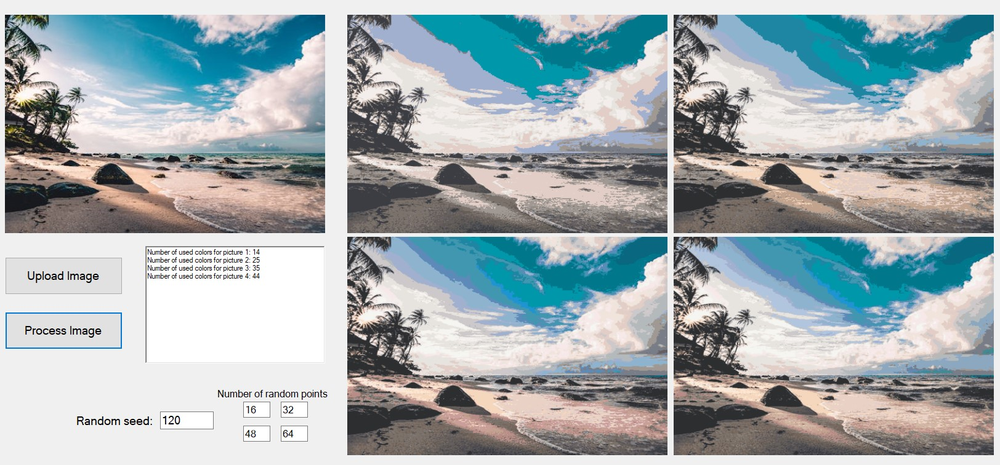

# Color Reduction Windows Form

Windows form that allows reduction of number of colors on the picture. Main purpose is to make image look more like a painting using colors of existing paints listed in the csv file.

## How to use

There are 2 main working modes for color reduction and 1 experimental mode for smoothing out edges of color sectors right now.

### Main working principle

The main working principle for reduction is that some number of points is chosen from the image (either randomly or picked by user). The program finds closest colors to the picked ones in the pallete of existing colors that is described in the csv file. Then, each pixel of the image is replaced by the closest color from the available ones.

### Random points mode

In this working mode pixels for the color choosing are picked randomly from the image. User can change number of points picked for each output image. Right now there are 4 output images on the form, for each output image there is a text box to set number of pixels to pick. User also can change random seed for the picking algorithm to try get different outcomes.

